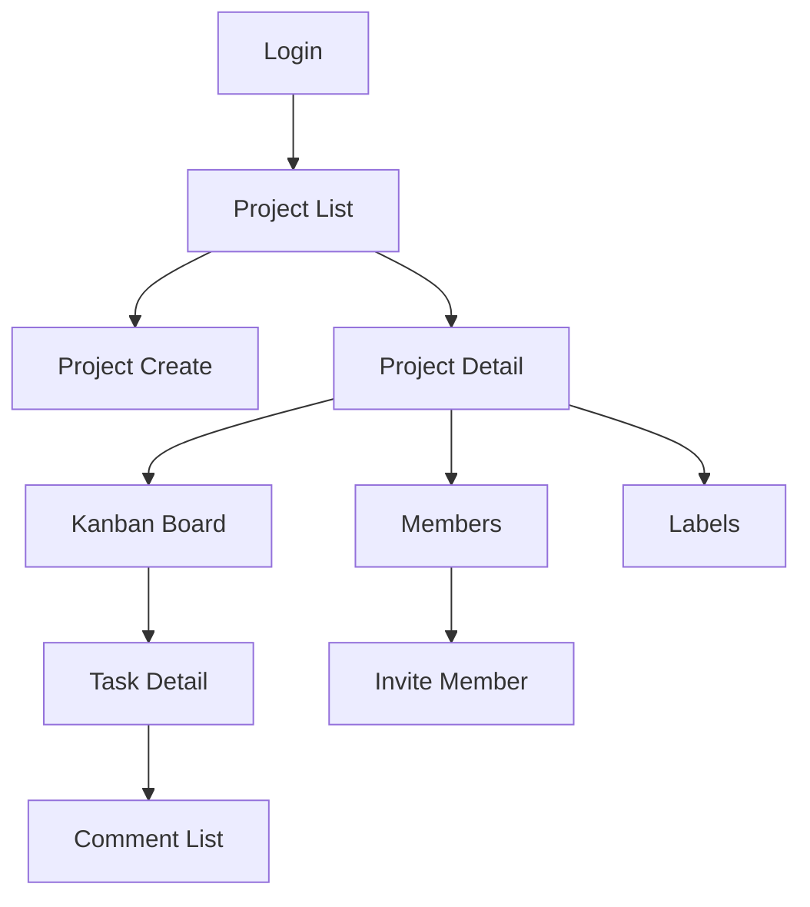
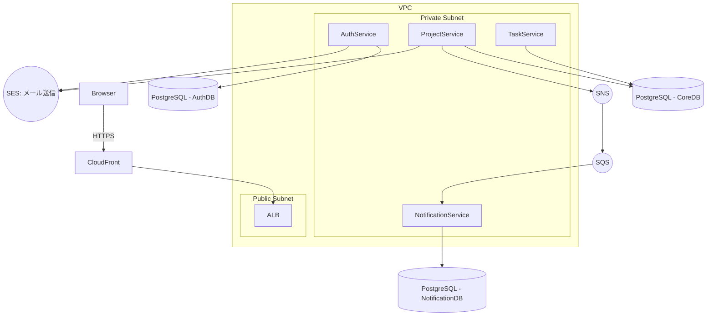

# TeamFlow 要件定義書 v1.0
スタートアップ流プロダクト仕様書  
作成者：小柳 和博 × ChatGPT（共同作成）  
作成日：2025/12/4

---

# 1. プロダクト概要（Overview）

## プロダクト名
**TeamFlow（チームフロー）**

## 一言でいうと
小〜中規模チームのための  
**「軽量 × 高機能 × コラボに強い」**  
プロジェクト管理ツール。

## 想定利用者
| 区分 | 内容 |
|------|------|
| 個人 | フリーランス、個人開発者、学生 |
| 小規模チーム | Web制作、同人開発、スタートアップ |
| 中規模チーム | 10〜50名の開発・マーケチーム |

## 解決したい問題
- 管理ツールが複雑で使われない
- Slack/Discord/Spreadsheet 管理が破綻しやすい
- 招待や権限管理が弱い
- コメントや議論が分散する
- Trello（軽い）と Jira（重い）の“間”が存在しない

## コア価値
1. **直感的な操作UX（Flow体験）**
2. 小〜中規模に最適な“必要十分”の機能量
3. 強い招待・権限管理
4. マイクロサービス構成による強い拡張性

---

# 2. 課題（Pain）と価値（Value）

## 課題（Pain）
- 複雑なツール → 使いこなせない
- 軽すぎるツール → 欠機能で困る
- 招待・権限が弱く、管理者に負担
- コメントがSlackなどに分散してしまう
- カンバン管理が重い／遅い

## 価値（Value）
### 1. シンプルなUIで即使える  
初見3分で理解できる操作性。

### 2. 必要な機能だけ厳選  
“軽いのに不十分じゃない” を実現。

### 3. 招待・権限の強化  
owner / admin / member

### 4. 技術的に強い基盤  
Next.js + TypeScript + Go + AWS + Microservices

---

# 3. ペルソナ

## ペルソナ1：個人開発者
- 個人 or 友人と共同開発
- シンプルさ重視

## ペルソナ2：小規模制作チーム
- クライアント案件が多い
- Slack管理が破綻ぎみ
- タスクに期限・担当者が必須

## ペルソナ3：学生・同人チーム
- 無料枠必須
- 招待の簡易さが重要

---

# 4. ユースケース一覧（Use Cases）

## UC-1：ユーザー登録
- email + password  
- 将来 OAuth / WebAuthn 対応

## UC-2：ログイン／ログアウト／リフレッシュ

## UC-3：プロジェクト作成・編集

## UC-4：メンバー招待
- 招待リンク
- メール招待
- 権限：admin/member

## UC-5：タスク管理
- 追加・編集・削除
- カンバン移動
- 担当者割当
- 優先度
- 期限

## UC-6：コメント
- 投稿、編集（自分のみ）、削除

## UC-7：ラベル
- 作成、編集、削除
- タスクへ付与

---

# 5. 画面一覧 & 画面遷移図

## 画面一覧
- Login
- Project List
- Project Create
- Project Detail
- Kanban Board
- Task Detail
- Comments
- Members
- Invitations
- Labels

## 画面遷移図（Mermaid）

---

# 6. 機能一覧（Functional Requirements）

## Authentication
- signup（email + password）
- login / logout
- refresh token
- OAuth（Google / GitHub / X）※後続
- WebAuthn（検討）

## Authorization（権限）
- owner
- admin
- member

## Projects
- 作成 / 更新 / 詳細
- アーカイブ

## Members
- メンバー追加（email or 招待リンク）
- 権限変更
- メンバー削除

## Invitations
- 招待メール
- 招待リンク
- トークン検証
- 有効期限

## Tasks
- 作成 / 更新 / 削除
- ステータス（todo / doing / done）
- カンバン移動
- priority
- dueDate
- assignee
- sortOrder

## Comments
- 投稿
- 編集（自分）
- 削除（自分）

## Labels
- 作成
- 編集
- 削除
- タスクへの付与 / 解除

---

# 7. 非機能要件（NFR）

## パフォーマンス
- カンバン移動：100ms以内
- プロジェクト表示：500ms以内

## 可用性
- 99.9%（AWSベース）

## セキュリティ
- OWASP Top 10 対応  
- XSS / CSRF / SQLi / セッション固定化  
- パス・ザ・クッキー攻撃対策  
- Cookie Secure（HttpOnly, Secure, SameSite）

## 拡張性
- マイクロサービス  
- OpenAPI 3  
- DB三分割

## 開発プロセス
- TDD採用  
- APIテスト（OpenAPI準拠）  
- CI/CD（GitHub Actions）

---

# 8. 技術仕様（Tech Specs）

## 技術スタック
- Frontend：Next.js + TypeScript + Tailwind
- AuthService：TypeScript（Node.js）
- Backend Services：Go
- DB：PostgreSQL（AuthDB / CoreDB / NotificationDB）
- Infra：AWS（ECS, RDS, CloudFront, S3, SES, SNS+SQS）
- ORM：Prisma または sqlc
- API：OpenAPI 3.0

---

# 8-1. システム構成図（Mermaid）

---

# 8-2. DB 設計（ER 図相当：テーブル定義一覧）

Mermaid の `erDiagram` はツール間で解釈の差異が大きく、
VS Code でのプレビューでエラーとなるため、本要件定義書では
**テーブル定義を Markdown テーブル形式で記述する方針** とする。

将来的に図として可視化したい場合は、この定義を元に
Mermaid / Draw.io / dbdiagram.io などで ER 図を生成する。

---

## USERS テーブル

| カラム名      | 型      | 制約            | 説明                |
|--------------|---------|-----------------|---------------------|
| id           | uuid    | PK              | ユーザーID          |
| name         | string  | NOT NULL        | 表示名              |
| email        | string  | UNIQUE, NOT NULL| メールアドレス      |
| passwordHash | string  | NOT NULL        | パスワードハッシュ  |
| createdAt    | datetime| NOT NULL        | 作成日時            |
| updatedAt    | datetime| NOT NULL        | 更新日時            |

---

## PROJECTS テーブル

| カラム名   | 型      | 制約                 | 説明                    |
|-----------|---------|----------------------|-------------------------|
| id        | uuid    | PK                   | プロジェクトID          |
| ownerId   | uuid    | FK → USERS.id        | オーナーユーザーID      |
| name      | string  | NOT NULL             | プロジェクト名          |
| description | string| NULLABLE             | 説明                    |
| status    | string  | NOT NULL             | active / archived       |
| createdAt | datetime| NOT NULL             | 作成日時                |
| updatedAt | datetime| NOT NULL             | 更新日時                |

---

## PROJECT_MEMBERS テーブル

| カラム名   | 型      | 制約                         | 説明                     |
|-----------|---------|------------------------------|--------------------------|
| projectId | uuid    | PK, FK → PROJECTS.id         | プロジェクトID           |
| userId    | uuid    | PK, FK → USERS.id            | ユーザーID               |
| role      | string  | NOT NULL                     | owner / admin / member   |
| joinedAt  | datetime| NOT NULL                     | 参加日時                 |

---

## INVITATIONS テーブル

| カラム名   | 型      | 制約                         | 説明                      |
|-----------|---------|------------------------------|---------------------------|
| id        | uuid    | PK                           | 招待ID                    |
| projectId | uuid    | FK → PROJECTS.id             | 対象プロジェクト          |
| email     | string  | NOT NULL                     | 招待先メールアドレス      |
| token     | string  | UNIQUE, NOT NULL             | 招待トークン              |
| role      | string  | NOT NULL                     | admin / member            |
| expiresAt | datetime| NOT NULL                     | 有効期限                  |
| acceptedAt| datetime| NULLABLE                     | 受諾日時                  |

---

## TASKS テーブル

| カラム名   | 型      | 制約                         | 説明                      |
|-----------|---------|------------------------------|---------------------------|
| id        | uuid    | PK                           | タスクID                  |
| projectId | uuid    | FK → PROJECTS.id             | 所属プロジェクト          |
| title     | string  | NOT NULL                     | タスク名                  |
| description | string| NULLABLE                     | 詳細説明                  |
| status    | string  | NOT NULL                     | todo / doing / done       |
| priority  | string  | NOT NULL                     | low / medium / high       |
| assigneeId| uuid    | FK → USERS.id, NULLABLE      | 担当者ID                  |
| dueDate   | date    | NULLABLE                     | 期限日                    |
| sortOrder | int     | NOT NULL                     | カンバン上の並び順        |
| createdAt | datetime| NOT NULL                     | 作成日時                  |
| updatedAt | datetime| NOT NULL                     | 更新日時                  |

---

## COMMENTS テーブル

| カラム名   | 型      | 制約                         | 説明                      |
|-----------|---------|------------------------------|---------------------------|
| id        | uuid    | PK                           | コメントID                |
| taskId    | uuid    | FK → TASKS.id                | 対象タスクID              |
| authorId  | uuid    | FK → USERS.id                | 投稿者ユーザーID          |
| body      | string  | NOT NULL                     | 本文                      |
| createdAt | datetime| NOT NULL                     | 作成日時                  |
| updatedAt | datetime| NOT NULL                     | 更新日時                  |

---

## LABELS テーブル

| カラム名   | 型      | 制約                         | 説明                      |
|-----------|---------|------------------------------|---------------------------|
| id        | uuid    | PK                           | ラベルID                  |
| projectId | uuid    | FK → PROJECTS.id             | 対象プロジェクト          |
| name      | string  | NOT NULL                     | ラベル名                  |
| color     | string  | NOT NULL                     | 表示色（例：#RRGGBB）     |

---

## TASK_LABELS テーブル（中間テーブル）

| カラム名   | 型      | 制約                         | 説明                      |
|-----------|---------|------------------------------|---------------------------|
| taskId    | uuid    | PK, FK → TASKS.id            | タスクID                  |
| labelId   | uuid    | PK, FK → LABELS.id           | ラベルID                  |

---

## リレーション概要（文章による説明）

- USERS 1 — N PROJECTS（ownerId）  
- USERS N — N PROJECTS（PROJECT_MEMBERS 経由）  
- PROJECTS 1 — N TASKS  
- TASKS 1 — N COMMENTS  
- PROJECTS 1 — N LABELS  
- TASKS N — N LABELS（TASK_LABELS 経由）  
- PROJECTS 1 — N INVITATIONS

---

# 9. セキュリティ方針（Your 41 items → 5カテゴリ整理）

## A. Webアプリ攻撃（すべて対応）
- XSS  
- CSRF  
- SQL Injection  
- OS Command Injection  
- Directory Traversal  
- Zero-day対策（定期スキャン）  
など15項目以上

## B. 認証／セッション攻撃（すべて対応）
- セッション固定化  
- ハイジャック  
- パス・ザ・クッキー  
- リプレイ攻撃

## C. ネットワーク攻撃
- DDoS  
- SYN Flood  
→ AWS ALB + AWS Shield

## D. ソーシャルエンジニアリング
- 偽ログイン対策（UIで警告）
- メールのSPF/DKIM/DMARC対応

## E. 内部攻撃・ゼロデイ
- CI/CDで脆弱性チェック
- 定期アップデート

---

# 10. 運用コスト

## 課金前提
- RDS：2000〜5000円
- ECS：2000〜6000円
- SES：数十円〜  
**→ 合計：5000〜12000円/月**

## 無課金案
- Supabase（Free）
- Vercel（Free）
- n8n（Queue代替）

---

# 11. リスクと対処

| リスク | 対処 |
|-------|------|
| 長期開発 | スプリント運用 |
| 複雑化 | TDD + OpenAPI |
| 初期ユーザー獲得 | 無料枠 + PR |
| セキュリティ | 41項目チェック |
| 負荷 | AWS 標準構成 |

---

# 12. ロードマップ（MVP → β → V1.0）

## MVP
- Auth（email/password）
- Project CRUD
- Task CRUD + Drag & Drop

## β版
- メンバー招待
- コメント
- ラベル

## V1.0
- 通知（メール/アプリ内）
- OAuth（Google/GitHub）
- WebAuthn
- プロジェクトアーカイブ

---

# 13. 将来拡張（AuthHub / DevDeployer）

## AuthHub
TeamFlowのAuthServiceをそのまま独立可能。

## DevDeployer
通知・プロジェクト管理ロジックを再利用可能。

---

# END
TeamFlow 要件定義書 v1.0（完）
